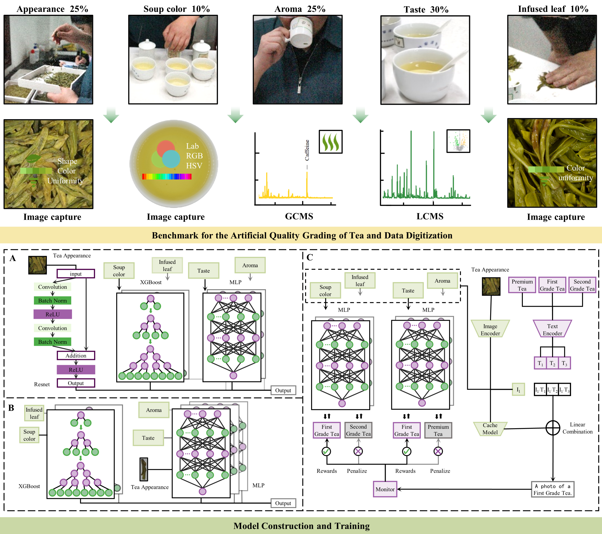

# Multimodal Intellengent Grading: AI Replacing Tea Master Evaluation Using Five Core Criteria

## Introduction
Traditional tea quality evaluation depends on human evaluators, limiting scalability and consistency. To establish AI replacement for comprehensive evaluation of tea quality and detailed assessment of the tea consumption experience, this study aims to develop Long-Tea-CLIP (Contrastive Language-Image Pre-training), an multimodal tea grading system that combines computer vision and chemoinformatics.

<div align="center">
  
</div>

## Requirements
### Installation
Create a conda environment and install dependencies:
```bash
git clone https://github.com/2521614022/Long-Tea.git
cd Long-Tea

conda create -n Long-Tea python=3.6.3
conda activate Long-Tea

pip install -r requirements.txt

# Install the according versions of torch and torchvision
conda install pytorch torchvision cudatoolkit
```

## Get Started
### Configs
For Tip-CLIP, the running configurations can be modified in `configs/tea.yaml`, including shot numbers, visual encoders, and hyperparamters. 

For simplicity, we provide the hyperparamters achieving the overall best performance on -1\16 shots for a dataset, which accord with the scores reported in the paper. If respectively tuned for different shot numbers, the -1\16-shot performance can be further improved. You can edit the `search_scale`, `search_step`, `init_beta` and `init_alpha` for fine-grained tuning.

Note that the default `load_cache` and `load_pre_feat` are `False` for the first running, which will store the cache model and val/test features in `configs/dataset/`. For later running, they can be set as `True` for faster hyperparamters tuning.

For the multi-modal evaluation system, the sub-dimensional model weights have been saved in the ` caches/` directory, including the shape comment evaluation model weights, the metabolomics data regression model weights, the GC-MS data prediction model weights, the soup color and leaf base analysis model weights.

### Running
```bash
CUDA_VISIBLE_DEVICES=0 python main.py --config configs/tea.yaml
```
After deploying the dataset, the fine-tuning of Tip-CLIP-F will be automatically conducted after the training-free Tip-CLIP. The multi-modal evaluation system of tea quality has successively carried out comment classification, score prediction and quality category output.

## Contact
If you have any question about this project, please feel free to contact 2521614022@qq.com.
